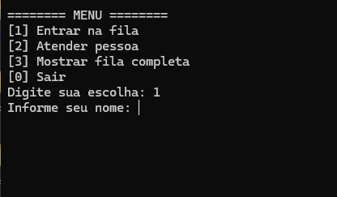
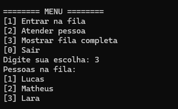
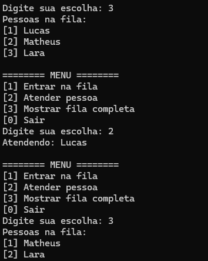

Sistema de Atendimento - Fila em C
------------------------------------------------------------------------------------
Este projeto é um sistema simples de atendimento baseado em fila, desenvolvido em linguagem C.  
O programa permite adicionar pessoas à fila, atender a próxima pessoa, exibir a fila atual e salvar tudo em um arquivo `.txt`.

(1º PASSO) O sistema permite que insira uma pessoa na fila (Entrar Fila)

(2º PASSO) O sistema permite também que mostre o histórico de pessoas dentro da fila (Mostrar fila)

(3º PASSO) E por fim, o sistema permite que o primeiro a entrar na fila seja atendido.

Este pequeno projeto foi criado pra faculdade, da matéria Algoritmos e Etruturas de Dados.

Nele consiste em simular uma fila de atendimento utilizando uma estrutuda de dados chamada FILA

Essa estrutura trás o conceito de First in First Out (primeiro a entrar é o primeiro a sair).
